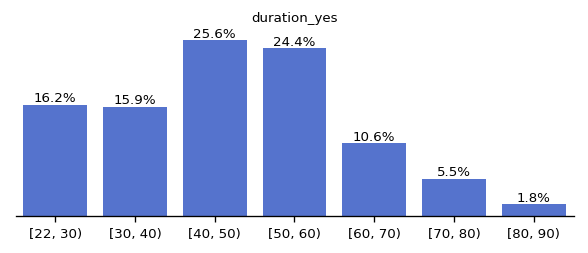
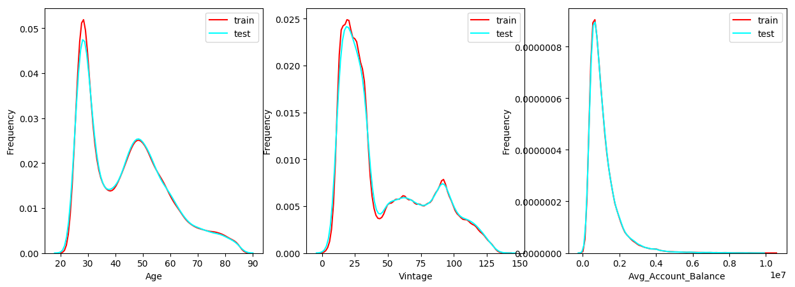
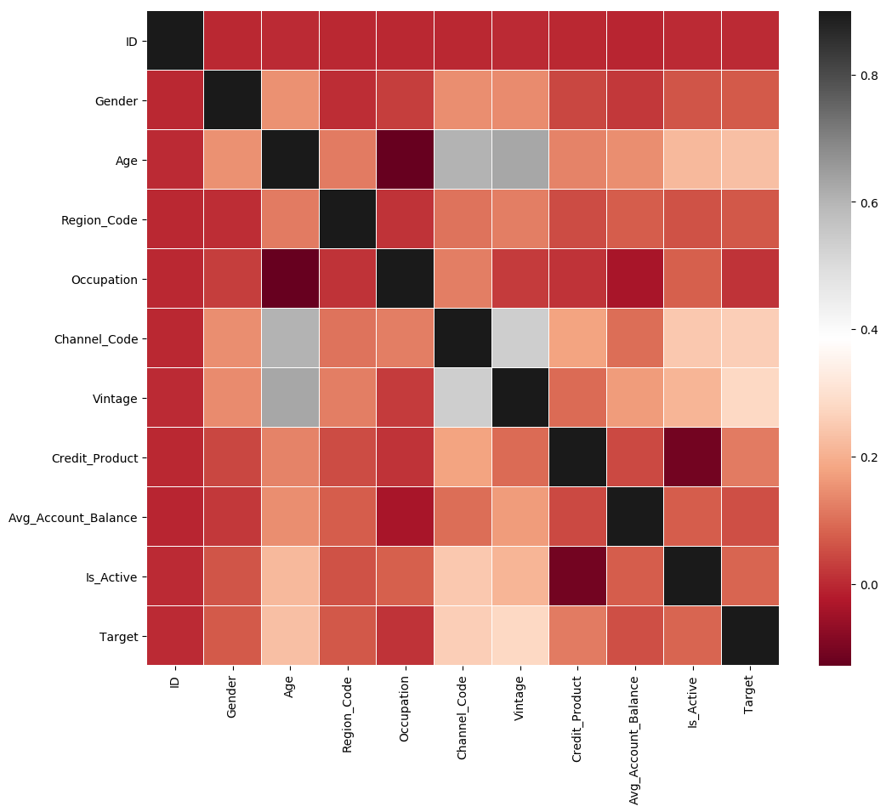

# 一、基于LightGBM实现银行客户信用违约预测

题目地址：[Coggle竞赛](https://competition.coggle.club/)

## 1.赛题介绍

信用评分卡（金融风控）是金融行业和通讯行业常见的风控手段，通过对客户提交的个人信息和数据来预测未来违约的可能性。对客户进行信用评分是一个常见的分类问题。

在本次赛题中需要参赛选手建立机器学习模型来预测申请人是“好”还是“坏”客户，与其他任务不同，没有给出“好”或“坏”的定义。 您应该使用一些技术，例如年份分析来构建您的标签。

## 2.数据介绍
赛题包含两部分训练集和测试集，选手需要在训练集上进行搭建模型，然后在测试集进行预测。

- train.csv，训练集
- test.csv，测试集
- sample\_submission.csv，测试集提交样例

数据字段介绍如下：

- ID，客户唯一标识
- Gender，客户性别
- Age，客户年龄
- Region\_Code，地区代码
- Occupation，客户职业
- Channel\_Code，客户渠道代码
- Vintage，客户服务月份
- Credit\_Product，信贷产品类型
- AvgAccountBalance，客户最近12个月平均账户余额
- Is\_Active，客户最近3个月是否活跃

## 3.提交格式
评分使用准确率进行评分，准确率值越大越好。

- 实操方案不允许使用外部数据集，不允许使用任何外部预训练模型。
- 实操方案需要在指定平台进行评分，提交csv格式。

提交格式样例：

```csv
ID,Target
AXM2EH3R,1
8ETNJAUW,1
VCSJTEPW,0
9EOYOOHV,0
```


## 4.总体思路

- 对缺失值进行处理，原本想全删掉，结果test也有，就填充了；
- 对离散值处理，直接分类，离散数据Encoder；
- 数据EDA，主要是确定各特征分布，其中离散的太多，时间太久就取消了；
- 使用lightGBM建立模型并训练；
- 保存结果并提交。

学习自：
- [江某1111号机](https://aistudio.baidu.com/aistudio/personalcenter/thirdview/1955078)数据Encode方式，非常方便。
- 江某1111号机 [基于LightGBM实现银行客户认购产品预测](https://aistudio.baidu.com/aistudio/projectdetail/5181254)

# 二、数据载入
## 1.数据读取

通过pandas读取数据


```python
import pandas as pd
import numpy as np
df=pd.read_csv("data/data207852/train.csv")
test=pd.read_csv("data/data207852/test.csv")
test.head(10)
```


<div>
<style scoped>
    .dataframe tbody tr th:only-of-type {
        vertical-align: middle;
    }

    .dataframe tbody tr th {
        vertical-align: top;
    }

    .dataframe thead th {
        text-align: right;
    }
</style>
<table border="1" class="dataframe">
  <thead>
    <tr style="text-align: right;">
      <th></th>
      <th>ID</th>
      <th>Gender</th>
      <th>Age</th>
      <th>Region_Code</th>
      <th>Occupation</th>
      <th>Channel_Code</th>
      <th>Vintage</th>
      <th>Credit_Product</th>
      <th>Avg_Account_Balance</th>
      <th>Is_Active</th>
    </tr>
  </thead>
  <tbody>
    <tr>
      <th>0</th>
      <td>AXM2EH3R</td>
      <td>Female</td>
      <td>43</td>
      <td>RG284</td>
      <td>Self_Employed</td>
      <td>X3</td>
      <td>26</td>
      <td>Yes</td>
      <td>1325325</td>
      <td>Yes</td>
    </tr>
    <tr>
      <th>1</th>
      <td>8ETNJAUW</td>
      <td>Female</td>
      <td>46</td>
      <td>RG282</td>
      <td>Self_Employed</td>
      <td>X2</td>
      <td>14</td>
      <td>No</td>
      <td>634489</td>
      <td>No</td>
    </tr>
    <tr>
      <th>2</th>
      <td>VCSJTEPW</td>
      <td>Female</td>
      <td>28</td>
      <td>RG254</td>
      <td>Self_Employed</td>
      <td>X1</td>
      <td>15</td>
      <td>No</td>
      <td>2215655</td>
      <td>No</td>
    </tr>
    <tr>
      <th>3</th>
      <td>9EOYOOHV</td>
      <td>Male</td>
      <td>58</td>
      <td>RG265</td>
      <td>Other</td>
      <td>X3</td>
      <td>15</td>
      <td>Yes</td>
      <td>925929</td>
      <td>Yes</td>
    </tr>
    <tr>
      <th>4</th>
      <td>S4B53OKJ</td>
      <td>Male</td>
      <td>75</td>
      <td>RG260</td>
      <td>Other</td>
      <td>X3</td>
      <td>111</td>
      <td>No</td>
      <td>721825</td>
      <td>Yes</td>
    </tr>
    <tr>
      <th>5</th>
      <td>3DTSVD9Y</td>
      <td>Female</td>
      <td>51</td>
      <td>RG268</td>
      <td>Self_Employed</td>
      <td>X1</td>
      <td>57</td>
      <td>No</td>
      <td>490345</td>
      <td>No</td>
    </tr>
    <tr>
      <th>6</th>
      <td>8WYWQUUX</td>
      <td>Male</td>
      <td>32</td>
      <td>RG279</td>
      <td>Salaried</td>
      <td>X1</td>
      <td>33</td>
      <td>No</td>
      <td>650483</td>
      <td>No</td>
    </tr>
    <tr>
      <th>7</th>
      <td>FPQTNHGY</td>
      <td>Female</td>
      <td>38</td>
      <td>RG270</td>
      <td>Salaried</td>
      <td>X1</td>
      <td>33</td>
      <td>NaN</td>
      <td>369777</td>
      <td>No</td>
    </tr>
    <tr>
      <th>8</th>
      <td>UXCKDQ34</td>
      <td>Male</td>
      <td>56</td>
      <td>RG254</td>
      <td>Self_Employed</td>
      <td>X2</td>
      <td>62</td>
      <td>Yes</td>
      <td>2406880</td>
      <td>Yes</td>
    </tr>
    <tr>
      <th>9</th>
      <td>CFTGOZHH</td>
      <td>Female</td>
      <td>29</td>
      <td>RG283</td>
      <td>Salaried</td>
      <td>X1</td>
      <td>20</td>
      <td>No</td>
      <td>659053</td>
      <td>No</td>
    </tr>
  </tbody>
</table>
</div>


```python
df.head(10)
```


<div>
<style scoped>
    .dataframe tbody tr th:only-of-type {
        vertical-align: middle;
    }

    .dataframe tbody tr th {
        vertical-align: top;
    }

    .dataframe thead th {
        text-align: right;
    }
</style>
<table border="1" class="dataframe">
  <thead>
    <tr style="text-align: right;">
      <th></th>
      <th>ID</th>
      <th>Gender</th>
      <th>Age</th>
      <th>Region_Code</th>
      <th>Occupation</th>
      <th>Channel_Code</th>
      <th>Vintage</th>
      <th>Credit_Product</th>
      <th>Avg_Account_Balance</th>
      <th>Is_Active</th>
      <th>Target</th>
    </tr>
  </thead>
  <tbody>
    <tr>
      <th>0</th>
      <td>ZYFGCP3R</td>
      <td>Male</td>
      <td>58</td>
      <td>RG264</td>
      <td>Self_Employed</td>
      <td>X2</td>
      <td>19</td>
      <td>No</td>
      <td>552449</td>
      <td>Yes</td>
      <td>0</td>
    </tr>
    <tr>
      <th>1</th>
      <td>MQJBCRCF</td>
      <td>Female</td>
      <td>45</td>
      <td>RG271</td>
      <td>Self_Employed</td>
      <td>X3</td>
      <td>104</td>
      <td>Yes</td>
      <td>525206</td>
      <td>No</td>
      <td>1</td>
    </tr>
    <tr>
      <th>2</th>
      <td>UZOQRG46</td>
      <td>Female</td>
      <td>30</td>
      <td>RG278</td>
      <td>Other</td>
      <td>X1</td>
      <td>25</td>
      <td>No</td>
      <td>724718</td>
      <td>No</td>
      <td>0</td>
    </tr>
    <tr>
      <th>3</th>
      <td>GCX6RVZS</td>
      <td>Female</td>
      <td>52</td>
      <td>RG283</td>
      <td>Self_Employed</td>
      <td>X1</td>
      <td>43</td>
      <td>Yes</td>
      <td>1452453</td>
      <td>No</td>
      <td>0</td>
    </tr>
    <tr>
      <th>4</th>
      <td>9V6BRARI</td>
      <td>Female</td>
      <td>76</td>
      <td>RG254</td>
      <td>Other</td>
      <td>X1</td>
      <td>57</td>
      <td>No</td>
      <td>1895762</td>
      <td>No</td>
      <td>0</td>
    </tr>
    <tr>
      <th>5</th>
      <td>WUGN99OM</td>
      <td>Male</td>
      <td>28</td>
      <td>RG275</td>
      <td>Salaried</td>
      <td>X1</td>
      <td>33</td>
      <td>No</td>
      <td>885576</td>
      <td>No</td>
      <td>0</td>
    </tr>
    <tr>
      <th>6</th>
      <td>EQ4CBNED</td>
      <td>Male</td>
      <td>31</td>
      <td>RG268</td>
      <td>Salaried</td>
      <td>X1</td>
      <td>33</td>
      <td>No</td>
      <td>653135</td>
      <td>Yes</td>
      <td>0</td>
    </tr>
    <tr>
      <th>7</th>
      <td>JZZ7MPIR</td>
      <td>Male</td>
      <td>48</td>
      <td>RG259</td>
      <td>Entrepreneur</td>
      <td>X2</td>
      <td>67</td>
      <td>Yes</td>
      <td>389553</td>
      <td>Yes</td>
      <td>1</td>
    </tr>
    <tr>
      <th>8</th>
      <td>KVHMRSES</td>
      <td>Female</td>
      <td>31</td>
      <td>RG254</td>
      <td>Salaried</td>
      <td>X1</td>
      <td>33</td>
      <td>No</td>
      <td>1543001</td>
      <td>No</td>
      <td>0</td>
    </tr>
    <tr>
      <th>9</th>
      <td>KS45GJCT</td>
      <td>Female</td>
      <td>48</td>
      <td>RG273</td>
      <td>Other</td>
      <td>X3</td>
      <td>105</td>
      <td>NaN</td>
      <td>360005</td>
      <td>Yes</td>
      <td>1</td>
    </tr>
  </tbody>
</table>
</div>


```python
df.info()
```

    <class 'pandas.core.frame.DataFrame'>
    RangeIndex: 195725 entries, 0 to 195724
    Data columns (total 11 columns):
     #   Column               Non-Null Count   Dtype 
    ---  ------               --------------   ----- 
     0   ID                   195725 non-null  object
     1   Gender               195725 non-null  object
     2   Age                  195725 non-null  int64 
     3   Region_Code          195725 non-null  object
     4   Occupation           195725 non-null  object
     5   Channel_Code         195725 non-null  object
     6   Vintage              195725 non-null  int64 
     7   Credit_Product       172279 non-null  object
     8   Avg_Account_Balance  195725 non-null  int64 
     9   Is_Active            195725 non-null  object
     10  Target               195725 non-null  int64 
    dtypes: int64(4), object(7)
    memory usage: 16.4+ MB


## 2.NaN处理
发现Credit_Product列有空值，怎么办？仔细一看test也有空值，不能简单的删除了，那就看这个值哪个多就填写哪个了。


```python
# 统计某列值  
df['Credit_Product'].unique()
```


    array(['No', 'Yes', nan], dtype=object)


```python
# 统计某列出现某值的次数  
df['Credit_Product'].value_counts()
```


    No     114910
    Yes     57369
    Name: Credit_Product, dtype: int64


可以看出，该列值主要为No，因此缺失值nan设置为No。


```python
test.info()
```

    <class 'pandas.core.frame.DataFrame'>
    RangeIndex: 50000 entries, 0 to 49999
    Data columns (total 10 columns):
     #   Column               Non-Null Count  Dtype 
    ---  ------               --------------  ----- 
     0   ID                   50000 non-null  object
     1   Gender               50000 non-null  object
     2   Age                  50000 non-null  int64 
     3   Region_Code          50000 non-null  object
     4   Occupation           50000 non-null  object
     5   Channel_Code         50000 non-null  object
     6   Vintage              50000 non-null  int64 
     7   Credit_Product       44121 non-null  object
     8   Avg_Account_Balance  50000 non-null  int64 
     9   Is_Active            50000 non-null  object
    dtypes: int64(3), object(7)
    memory usage: 3.8+ MB


```python
# 空值填No
df=df.fillna('No')
test=test.fillna('No')
```

## 2.数据EDA
- duration分箱展示
    
- 查看数据分布
    
- 数据相关图


```python
import matplotlib.pyplot as plt       
import seaborn as sns
%matplotlib inline
# 按年龄分布查看
ages=[22,30,40,50,60,70,80,90]
df1=df[df['Credit_Product']=='Yes']
binning=pd.cut(df1['Age'],ages,right=False)
time=pd.value_counts(binning)
# 可视化
time=time.sort_index()
fig=plt.figure(figsize=(6,2),dpi=120)
sns.barplot(time.index,time,color='royalblue')
x=np.arange(len(time))
y=time.values
for x_loc,jobs in zip(x,y):
    plt.text(x_loc, jobs+2, '{:.1f}%'.format(jobs/sum(time)*100), ha='center', va= 'bottom',fontsize=8)
plt.xticks(fontsize=8)
plt.yticks([])
plt.ylabel('')
plt.title('duration_yes',size=8)
sns.despine(left=True)
plt.show()
```


    

    


```python
# 分离数值变量与分类变量
Nu_feature = list(df.select_dtypes(exclude=['object']).columns)  
Ca_feature = list(df.select_dtypes(include=['object']).columns)
#查看训练集与测试集数值变量分布
import matplotlib.pyplot as plt       
import seaborn as sns
import warnings
warnings.filterwarnings("ignore")
plt.figure(figsize=(15,5))

Nu_feature.remove('Target')

# 根据数值型分布查看
i=1
for col in Nu_feature:
    ax=plt.subplot(1,3,i)
    ax=sns.kdeplot(df[col],color='red')
    ax=sns.kdeplot(test[col],color='cyan')
    ax.set_xlabel(col)
    ax.set_ylabel('Frequency')
    ax=ax.legend(['train','test'])
    i+=1
plt.show()
```


    

    


查看离散变量分布

由于时间太久，故不测

```
col1=Ca_feature
plt.figure(figsize=(20,10))
j=1
for col in col1:
    ax=plt.subplot(6,3,j)
    ax=plt.scatter(x=range(len(df)),y=df[col],color='red')
    plt.title(col)
    j+=1

k=7
for col in col1:
    ax=plt.subplot(6,3,k)
    ax=plt.scatter(x=range(len(test)),y=test[col],color='cyan')
    plt.title(col)
    k+=1
plt.subplots_adjust(wspace=0.4,hspace=0.3)  
plt.show()
```


```python
# 离散数据Encoder
from sklearn.preprocessing import LabelEncoder

lb = LabelEncoder()                               
cols = Ca_feature
for m in cols:
    df[m] = lb.fit_transform(df[m])
    test[m] = lb.fit_transform(test[m])
 
correlation_matrix=df.corr()
plt.figure(figsize=(12,10))
# 热力图
sns.heatmap(correlation_matrix,vmax=0.9,linewidths=0.05,cmap="RdGy")
```


    <matplotlib.axes._subplots.AxesSubplot at 0x7fa254ac6150>


    

    


# 三、建立模型

## 1. 切割训练集和测试集

这里使用留出法划分数据集，将数据集分为自变量和因变量。

按比例切割训练集和测试集(一般测试集的比例有30%、25%、20%、15%和10%)，使用分层抽样，设置随机种子以便结果能复现


```python
from lightgbm.sklearn import LGBMClassifier
from sklearn.model_selection import train_test_split
from sklearn.model_selection import KFold
from sklearn.metrics import accuracy_score, auc, roc_auc_score
 
X=df.drop(columns=['ID','Target'])
Y=df['Target']
test=test.drop(columns='ID')
# 划分训练及测试集
x_train,x_test,y_train,y_test = train_test_split( X, Y,test_size=0.3,random_state=1)
```

## 2. 模型创建

创建基于树的分类模型（lightgbm）

这些模型进行训练，分别的到训练集和测试集的得分


```python
# 建立模型
gbm = LGBMClassifier(n_estimators=600,learning_rate=0.01,boosting_type= 'gbdt',   
    objective = 'binary',
    max_depth = -1,  
    random_state=2022,           
    metric='auc')
```

# 四、模型训练
交叉验证介绍

- 交叉验证（cross-validation）是一种评估泛化性能的统计学方法，它比单次划分训练集和测试集的方法更加稳定、全面。
- 在交叉验证中，数据被多次划分，并且需要训练多个模型。
- 最常用的交叉验证是 k 折交叉验证（k-fold cross-validation），其中 k 是由用户指定的数字，通常取 5 或 10。

## 1.模型训练


```python
# 交叉验证
result1 = []
mean_score1 = 0
n_folds=5
kf = KFold(n_splits=n_folds ,shuffle=True,random_state=2022)
for train_index, test_index in kf.split(X):
    x_train = X.iloc[train_index]
    y_train = Y.iloc[train_index]
    x_test = X.iloc[test_index]
    y_test = Y.iloc[test_index]
    gbm.fit(x_train,y_train)
    y_pred1=gbm.predict_proba((x_test),num_iteration=gbm.best_iteration_)[:,1]
    print('验证集AUC:{}'.format(roc_auc_score(y_test,y_pred1)))
    mean_score1 += roc_auc_score(y_test,y_pred1)/ n_folds
    y_pred_final1 = gbm.predict_proba((test),num_iteration=gbm.best_iteration_)[:,1]
    y_pred_test1=y_pred_final1
    result1.append(y_pred_test1)
```

    验证集AUC:0.7889931707362382
    验证集AUC:0.7894677985120346
    验证集AUC:0.7931272562656144
    验证集AUC:0.7850546301430752
    验证集AUC:0.7876841341097264


## 2.模型评估


```python
# 模型评估
print('mean 验证集auc:{}'.format(mean_score1))
cat_pre1=sum(result1)/n_folds
```

    mean 验证集auc:0.7888653979533378


## 3.输出结果

将预测结果按照指定格式输出到result.csv文件中


```python
ret1=pd.DataFrame(cat_pre1,columns=['Target'])
ret1['Target']=np.where(ret1['Target']>0.5,'1','0').astype('str')

result = pd.DataFrame()
test=pd.read_csv("data/data207852/test.csv")
result['ID'] = test['ID']
result['Target'] = ret1['Target']

result.to_csv('result.csv',index=False)
```


```python
print(test.columns)
```

    Index(['ID', 'Gender', 'Age', 'Region_Code', 'Occupation', 'Channel_Code',
           'Vintage', 'Credit_Product', 'Avg_Account_Balance', 'Is_Active'],
          dtype='object')


# 五、提交
第一次提交错了，第二次刷新过头了


# Bank_customer_credit_default_forecast

